.. _english_readme:

This repository is a collection of guides, images, and ideas regarding the modification of Xiaomi/Aqara sensors.

The modifications are purely hardware-based, with the idea of being able to use the modified sensors with the Lumi gateway and MiHome app.

It's possible to "hack"/modify some Xiaomi sensors to use them in alternative ways. From the original sensor, it's possible to create other types of sensors, usable with MiHome and/or any home automation system (Domoticz, Home Assistant, OpenHAB, etc.). With the use of these systems, there is much more freedom in automation, customization, and general usage of the modified sensor.

Currently, the only sensor I've tested the modification on is the Door/Window Sensor, so the guide will mainly focus on this. The hack works similarly on other sensors. Each sensor has the potential to be used in different ways.

=========================
Xiaomi Door/Window Sensor
=========================

There are several reasons why I prefer this sensor over others, such as the switch.

Advantages:

- It's the smallest among all Xiaomi sensors.
- It's the cheapest (it can even cost around €3.5).
- Being a binary sensor, the operating system is very simple.

The actual modification consists of soldering two wires (or directly a component) to the two pins on the sensor's board.

In the original sensor, a reed switch, a magnetic laminate sensor, is soldered to the two pins. By soldering an external switch to the two pins, it's possible to use it to open and close the circuit and thus send the signal to the gateway.

If desired, the original component could also be desoldered, but this is generally not recommended, except in cases where you need to position the sensor near magnets.

**IMPORTANT**

This is the interesting part. By switch, I don't just mean a simple switch, but a set of switches that open and close the circuit based on different conditions. This part regarding switches will be detailed later; here, I'll just leave you with some of the possible uses:

- Rain/flood sensor
- Temperature sensor (opens/closes the circuit when a certain temperature is exceeded)
- Vibration sensor
- Mercury switch (usable for acceleration and as a tilt switch)

Functioning
---------

I'll explain simply (as I'm quite ignorant in the field) how the original sensor works.

The reed switch consists of two laminates, made of ferromagnetic material, sealed inside a container filled with inert gas. The two laminates protrude from the container, forming the two terminal pins. In the case of the door/window sensor, the two terminals are soldered to the two pins on the board.

Normally, the laminates are separated by a few tenths of a millimeter. The sensor detects that the circuit is open and sends the "Open" state to the gateway. By bringing the magnet close to the sensor, if the magnetic field is strong enough, the attractive force will cause the two laminates to touch, closing the circuit. At this point, the sensor will detect the closure of the circuit and send the "Closed" state to the gateway.

Modification
------------

To make the modification, you'll need some tools and components:

- Soldering iron and solder
- Xiaomi door/window sensor
- Electrical wire (not too small or too large, recommended size: 22 gauge AWG)

Optional:

- Switch/interchange (**we'll see the different types later**)
- Drill and bit, slightly larger than the diameter of the electrical wire

The switch is optional because to test the correct operation, it will be enough to short-circuit the two wire ends. The drill will be used to drill the case and continue using it even after the modification.

Opening
-------

Opening is relatively easy. First, locate the groove on the short side of the sensor.

.. image:: teardown/door_sensor.jpg

Leverage with a screwdriver, without applying too much force, to avoid damaging the case.

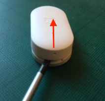

Now, remove the CR1632 battery.

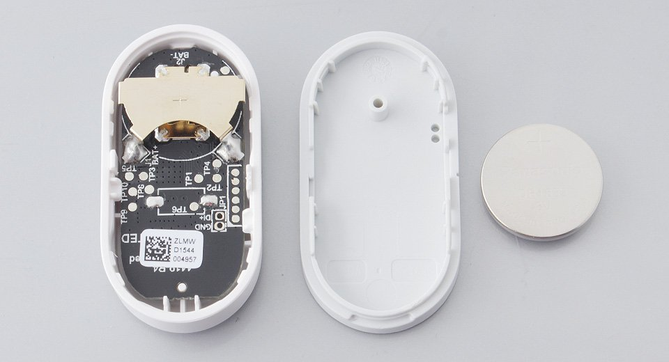

Now you can see the board. To remove it, leverage again in one of the slots between the case and the board. You can use a toothpick, just a little force will make it pop out.

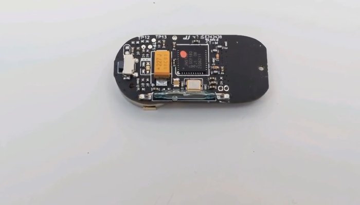

Soldering
---------

Now position the board so that it stays still, if you don't have a third hand, use some tape.

Locate the two pins connected to the reed switch.

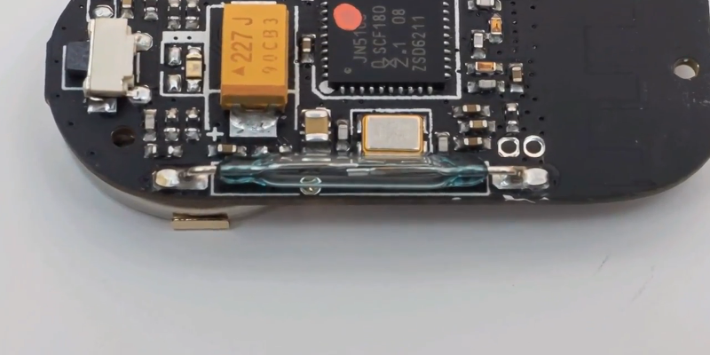

Now take the electrical wire and cut two sections of 10cm each, don't worry about the length, we'll adjust it later. Strip the two ends of the wires, twist the filaments, and cut again to leave 3/4 mm of copper. Solder some solder on both pins, and then by re-melting the solder on the pins, position and solder the two wires.

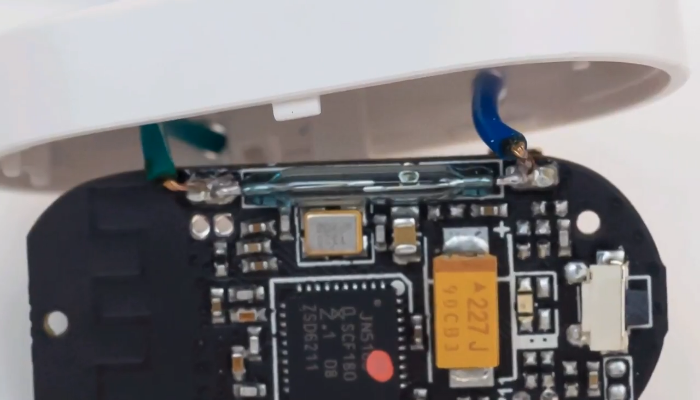

Check that you haven't made any bridges and that the wires are well connected. If not, re-melt the solder, and depending on the case, add or remove some solder.

Test
----

At this point, strip the other ends, rethe battery, and touch the two copper ends together. Open your app and/or interface (in the case of HA, Domoticz, OpenHAB, etc.), and you'll see the "door/window" closed.

If it doesn't work, check:

- That you've soldered the two wires correctly.
- That you haven't accidentally pressed the reset button.

Drilling the Case
-----------------

Rethe board into the case and mark a point with the pencil corresponding to the two pins.

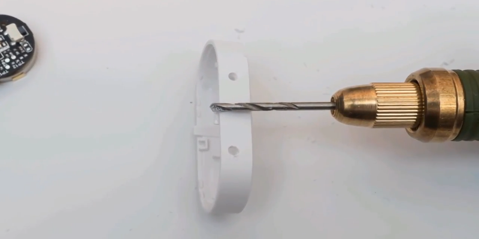

Now drill the case with a bit slightly larger than the wire diameter.

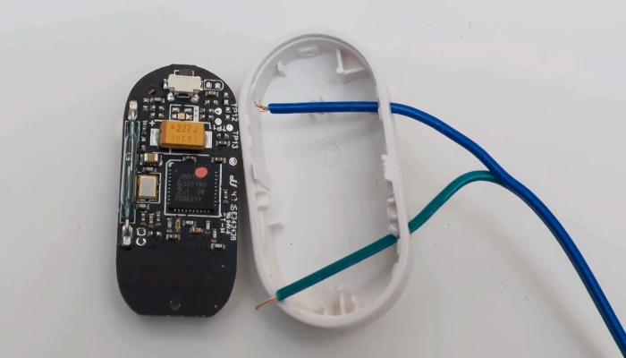

Now you can connect any button, switch, light switch, and an infinite number of sensor-switches.

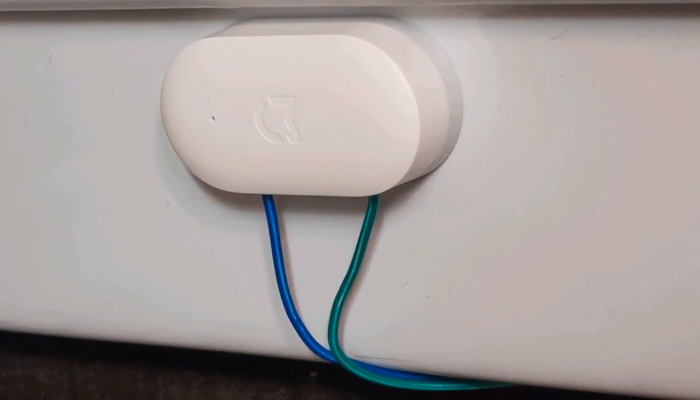

Now let's see some of the many possibilities.

------------------------------------------------------------------------------------------------------------

**TYPES OF SWITCHES THAT CAN BE USED**
--------------------------------------

Light switch
------------

If you have Yeelight bulbs or other Xiaomi bulbs at home, you've surely forgotten at least once not to press the light switch, or someone else in the house did it for you.

By using the sensor you modified, you can overcome this problem.

Disconnect the power supply to the house, disassemble the switch, and disconnect the two phases from the switch.

Connect the two wires from the sensor to the switch, don't forget the battery. Now you have a wireless light switch. Remember to short-circuit the two phases with a clip, so the bulb remains powered.

.. image:: sensors/door_sensor_lights_switch.JPG

(DEVICERS)
^^^^^^^^^^^

As for the deviators, you should find out which wires, if connected, turn on the light, then short-circuit them with a clip and isolate the remaining ones. All this with the power supply disconnected. This way, the bulb will always be powered.

Since the sensor is not exposed to the outside, you can avoid drilling the case in this case.

------------------------------------------------------------------------------------------------------------

Rain/flood sensor
------------------

This switch consists of a simple board on which two serpentine traces are printed. Water placed on the board will act as a conductor, closing the circuit.

In this case, when it's not raining, our sensor will be open, and when it's raining, it will be closed.

It can also be used as a flood sensor and for other purposes.

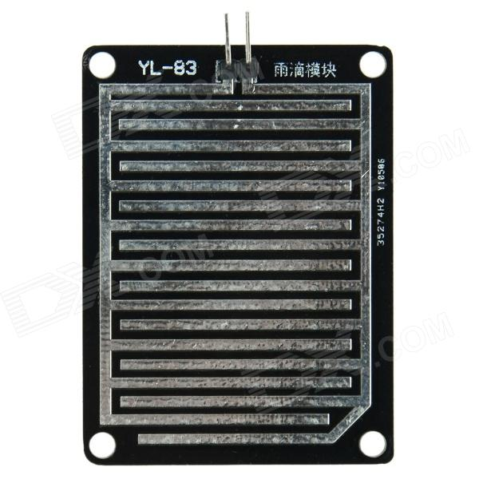
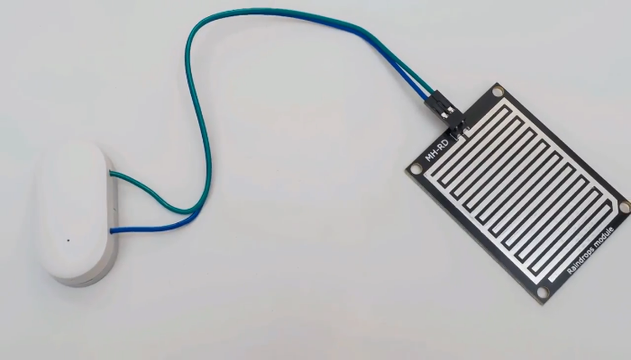

------------------------------------------------------------------------------------------------------------

Temperature sensor
------------------

Regarding temperature, it's possible to use thermal fuses that close/open at a certain temperature.

You can choose the temperature at which the switch will open or close the circuit. It's also possible to choose whether they normally remain open or closed.

With some, it's also possible to adjust at which temperature they will activate.

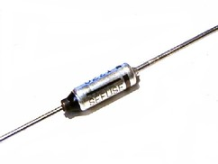

------------------------------------------------------------------------------------------------------------

Touch/button sensor
--------------------

It's possible to connect any type of button, from the simplest ones to panic buttons.

It's also possible to connect capacitive touch sensors, which work the same way as normal buttons, except that instead of a physical button, there's a touch surface that, when touched with a finger, closes the circuit.

Its functions are quite limited when using MiHome.

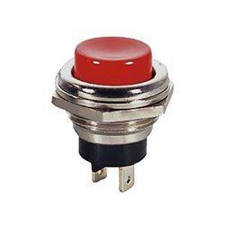
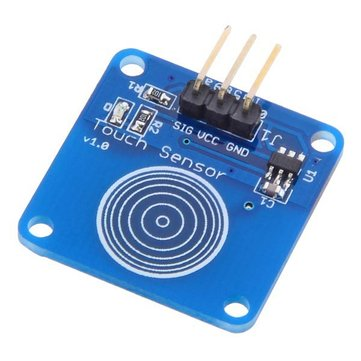

------------------------------------------------------------------------------------------------------------

Tilt sensor
------------

These exist with both a simple metal ball and a drop of mercury. At a certain inclination, the ball, due to gravity, will slide to one of the two ends of the container, connecting the two pins and thus closing the circuit.

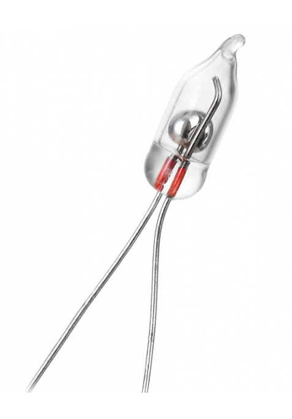

------------------------------------------------------------------------------------------------------------

Vibration sensor
-----------------

These are small cylinders with a pin in the center, and there's a coil wrapped around the pin. In case of vibrations, the coil will make contact with the pin, closing the circuit. There are different types with different sensitivities, and some are even adjustable.

It can be used to indicate an earthquake if sensitive enough.

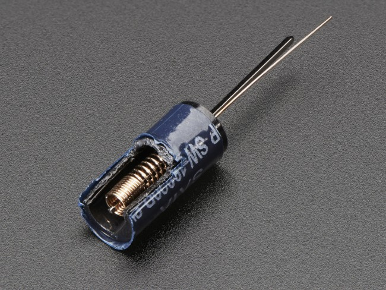

------------------------------------------------------------------------------------------------------------

These are just some of the possible sensors that can be used; I'll try to update the list over time.
If you have any ideas, I'll open a specific issue to suggest them.

Special thanks to Enrico__ for the idea.

.. __: https://t.me/Illoso

